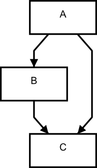
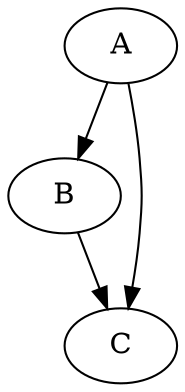

implexus-core
=============

Takes in a graph describing streams, and builds up the pipeline

```
npm install --save implexus-core
```

The library expects graphs generated through [Graphlib](https://github.com/cpettitt/graphlib/wiki).

Example
-------

Given a graph that looks like this:





And some stream factories that look like

```javascript
var modules = {
	array: function(naame, node, cb) {
		var but = require("but");
		var streamArray = require("stream-array");
		var source = (node.list || "")
			.split(",")
			.map(but(parseInt));
		var stream = streamArray(source);
		cb(null, stream);
	},
	stdout: function(name, node, cb) {
		var stdout = require("stdout");
		var prefix = node.prefix || "";
		cb(null, stdout(prefix));
	},
	adder: function(name, node, cb) {
		var map = require("through2-map").obj;
		var amount = parseInt(node.amount) || 1;
		cb(null, map(function(number) {
			return number + amount;
		}));
	},
	interval: function(name, node, cb) {
		var interval = require("interval-stream");
		var time = parseInt(node.time) || 1000;
		cb(null, interval(time));
	}
}
```

With a bit more code, we can wire it all up together!

```javascript
var implexus = require("../");
var dot = require("graphlib-dot");
var fs = require("fs");
var util = require("util")

var graph_src = fs.readFileSync(__dirname + "/graph.dot", "utf8");
var graph = dot.read(graph_src);

implexus.build(modules, graph, function(err, streams) {
	if (err) console.log(err, err.stack);
	else console.log("Stream map:", util.inspect(streams, {
		depth: 0
	}));
});
```

API
---

The library has a very small surface to make it super easy to integrate with.

### `build(modules, graph, cb)`

This parses out the graph, creates streams from the modules, and wires them up.

#### attributes

-	`modules` `Object<type,streamFactory()` : This is a map that contains all the `type`s of streams, and points to `streamFactory`s which create streams of that type.
-	`graph` `Graph` : This is an instance of a [graphlib graph](https://github.com/cpettitt/graphlib/wiki/API-Reference#graph-api)
-	`cb` `Function(err, stream_map)` : Callback that gets called when everything is wired up.

### `streamFactory(name, node, cb)`

This is what the format for the stream factories. It's supposed to take in the data for a graph node, and create a new stream from it.

#### attributes

-	`name` `String` : The name of the node in the graph
-	`node` `Object` : The node with properties for describing it
-	`cb` `Function(err,stream)` : This should get called with either an error object, or the resulting stream instance
